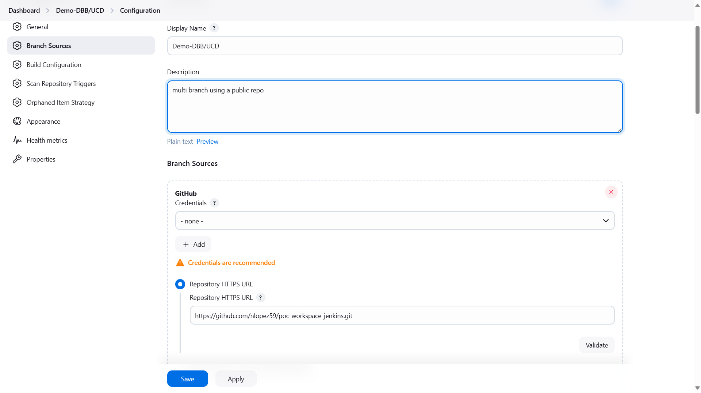
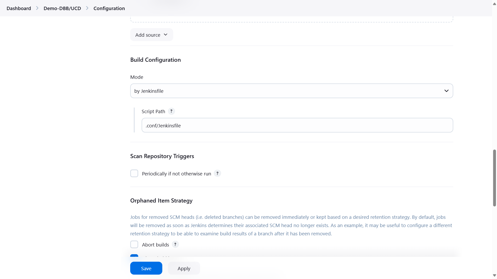
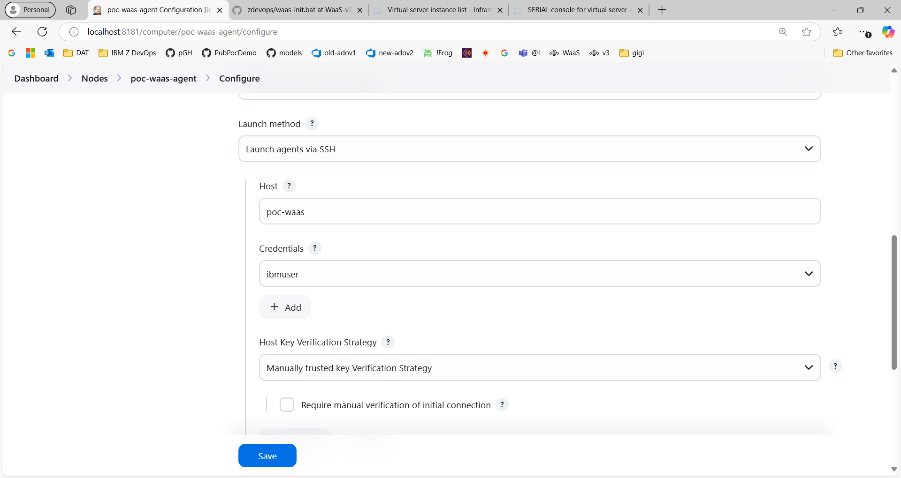
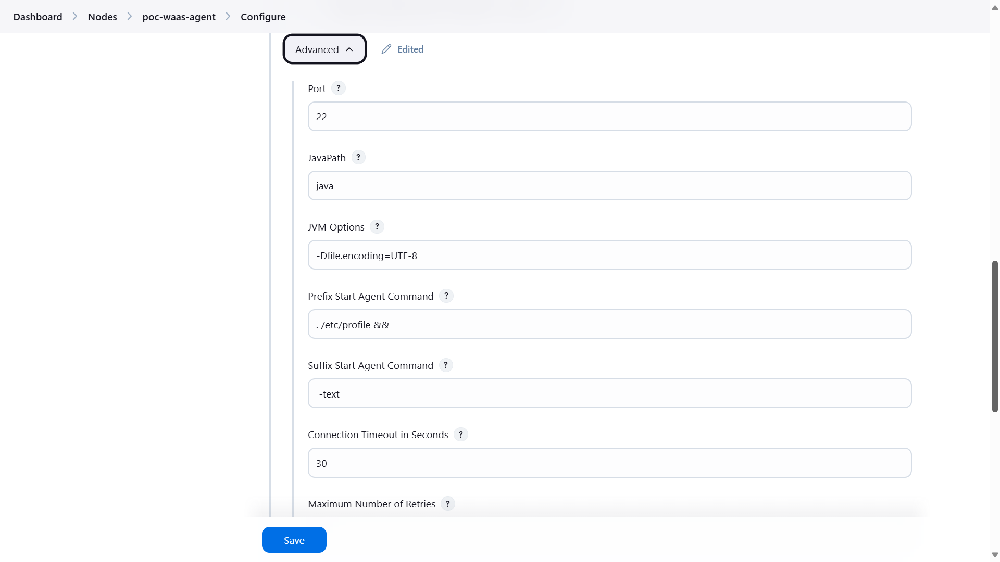
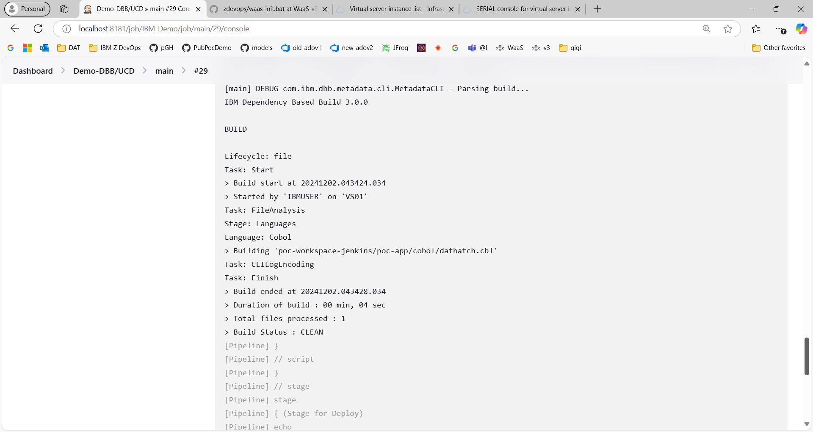

simple poc app for demos in jenkins 

got a new repo name 
using dbbv3 
can get ub to work???
hangs 
need to mount tmp and java 

Workls agent uses etc/rpfile 
jenksinfile has dbbv3 .profile 

job 

agent 

pipeline 

